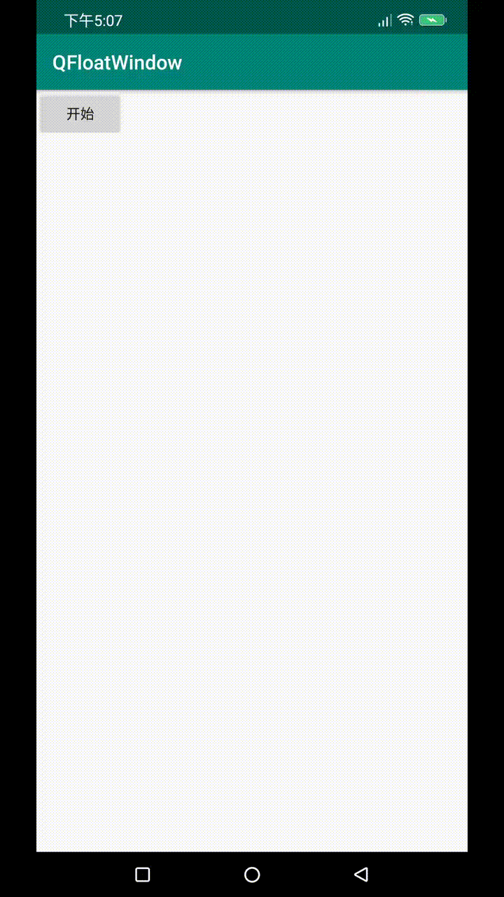

# QFWSideslip

## Download

maven

```groovy
<dependency>
  <groupId>com.amosyo</groupId>
  <artifactId>QFWSideslip</artifactId>
  <version>1.0.0</version>
  <type>pom</type>
</dependency>
```

gradle

```groovy
compile 'com.amosyo:QFWSideslip:1.0.0'
```

lvy

```groovy
<dependency org='com.amosyo' name='QFWSideslip' rev='1.0.0'>
  <artifact name='QFWSideslip' ext='pom' ></artifact>
</dependency>
```


## 示例

```java
QFWSS.create(this)
                .setIndicatorView(R.layout.view_indicator)
                .setContentView(R.layout.view_content)
                .setContentLayoutBackgroundColor(Color.parseColor("#33000000"))
                .setIndicatorLocation(QLocation.LOCATION_SCREEN_RIGHT)
                .show();
```

## 效果

